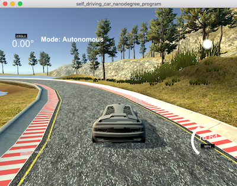
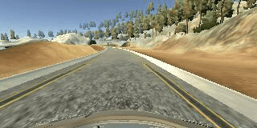
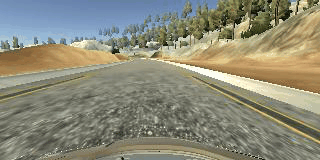
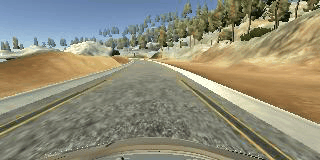
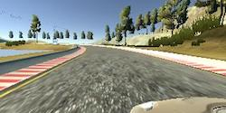
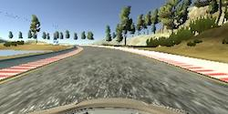
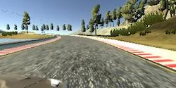

[//]: # (Image References)

[image1]: ./examples/placeholder.png "Model Visualization"
[image2]: ./examples/placeholder.png "Grayscaling"
[image3]: ./examples/placeholder_small.png "Recovery Image"
[image4]: ./examples/placeholder_small.png "Recovery Image"
[image5]: ./examples/placeholder_small.png "Recovery Image"
[image6]: ./examples/placeholder_small.png "Normal Image"
[image7]: ./examples/placeholder_small.png "Flipped Image"

# Behavioral Cloning Project [P3]
### Summary by Michael Berner, Student @ Udacity Self Driving Car NanoDegree 2018

[](http://www.udacity.com/drive)

Stuttgart, May 1st 2018

## Task / Problem description
*In this project, you will use what you've learned about deep neural networks and convolutional neural networks to clone driving behavior. You will train, validate and test a model using Keras. The model will output a steering angle to an autonomous vehicle.*

*We have provided a simulator where you can steer a car around a track for data collection. You'll use image data and steering angles to train a neural network and then use this model to drive the car autonomously around the track.* 



*We also want you to create a detailed writeup of the project. Check out the [writeup template](https://github.com/udacity/CarND-Behavioral-Cloning-P3/blob/master/writeup_template.md) for this project and use it as a starting point for creating your own writeup. The writeup can be either a markdown file or a pdf document.*


**The goals / steps of this project are the following:**

* Use the simulator to collect data of good driving behavior
* Build, a convolution neural network in Keras that predicts steering angles from images
* Train and validate the model with a training and validation set
* Test that the model successfully drives around track one without leaving the road
* Summarize the results with a written report

The full original project description is located at [Udacity's GitHub repository](https://github.com/udacity/CarND-Behavioral-Cloning-P3).

## Project Writeup & Rubric Points

In this section, I will consider the [rubric points](https://review.udacity.com/#!/rubrics/432/view) individually and describe how I addressed each point in my implementation. 


### Files Submitted & Code Quality

#### 1. Required files
*Submission includes all required files and can be used to run the simulator in autonomous mode*

My project includes the following files:

* **model.py** containing the script to create and train the model
* **drive.py** for driving the car in autonomous mode
* **model.h5** containing a trained convolution neural network 
* **README.md** summarizing the results (write_up.md was replaced with this readme file)

All files can be downloaded easily from my GitHub repository using the command

```
git clone https://github.com/thelukasssheee/CarND-Behavioral-Cloning-P3.git
```

#### 2. Submission includes functional code
Using the Udacity provided simulator and my ``drive.py`` file, the car can be driven autonomously around the track by executing ``python drive.py model.h5``

For additional fun and challenge, I tweaked the ``drive.py``to run at 30 mph instead of 8 mph. With the provided neural network, the car is still able to remain on the tarmac.

However, it is necessary to activate the Anaconda development environment carnd-term1 to have all necessary Python functions available with the correct version. ``source activate carnd-term1``

#### 3. Submission code is usable and readable

The ``model.py`` file contains the code for training and saving the convolution neural network. The file shows the pipeline I used for training and validating the model, and it contains comments to explain how the code works.

The code is structured in such a way, that it can read the training data which I created alongside with the Udacity data. This is indicated by the array ``use_datasets = [0,1,2]``. If you want to run the code with the originally provided data by Udacity in precisely the form it was provided, you need to uncomment the line ``# use_datasets = [3]`` and comment the line ``use_datasets = [0,1,2]``.

```
### Settings
use_datasets = [0,1,2]  # Array to select which datasets to process
# use_datasets = [3]      # Array to select which datasets to process
nb_epochs = 7           # Number of epochs for neural network training
batch_sz = 32           # Batch size for neural network
test_sz = 0.20          # Fraction of images to use for test set
steer_corr = 0.00       # Steering correction value (left, right camera)
dropout_keep_rate = 0.7 # Dropout rate to keep neurons

### List of available datasets
datasets = np.array([   'data/Udacity/driving_log.csv', \
                        'data/T1_Regular/driving_log.csv', \
                        'data/T1_OtherDir/driving_log.csv', \
                        'data/driving_log.csv'], \
                        dtype='str')
datasets = datasets[use_datasets]
```

### Model Architecture and Training Strategy

#### 1. An appropriate model architecture has been employed

My model consists of a convolution neural network, derived from a powerful network by [nVidia](https://devblogs.nvidia.com/) which was described in [their blog](https://devblogs.nvidia.com/parallelforall/deep-learning-self-driving-cars). 

The network starts with normalization and image cropping.

These steps are followed by several convolutions, each followed by a non-linearity through a ReLU activation function.  

#### 2. Attempts to reduce overfitting in the model

I experimented a bit with dropout layers, since I gathered a lot of positive experiences from the last project. 

However, for this neural network, the benefit of introducing dropouts was very limited. Almost no accuracy gain could be identified. The reason for this is most likely, that my neural network was trained on almost 50000 images, helping significantly to reduce the risk of overfitting.

The model was trained and validated on different data sets to ensure that the model was not overfitting (code line 25-28 combined with line 16).

The model was tested by running it through the simulator and ensuring that the vehicle could stay on the track.

#### 3. Model parameter tuning

The model used an adam optimizer, so the learning rate was not tuned manually (model.py line 138).

However, an additional parameter was assessed in detail. It was proposed, to use the left and right camera images as pseudo-center images for the training algorithm. The idea was to add some artificial steering angle to the left and right based camera views.

I tweaked this parameter in quite a wide range with a surprising result: reducing the additionally introduced steering angle back to 0.00 was yielding the best and most stable result.

| Additional steering angle  |     Validation loss | Result 8mph | Result 20 mph | Result 30 mph |
|:-------------------------:|:---------------------:|:-----------:|:------:|:----:| 
| 0.2          			| 0.0154 		| PASS | PASS | FAIL |
| 0.4   					| 0.0357  	| PASS | barely PASS | FAIL |
| 0.1			 			| 0.00101  	| PASS | PASS | FAIL |
| 0.05						| 0.0097   	| PASS | PASS | FAIL |
| 0.00						| 0.0092		| PASS | PASS | PASS |

#### 4. Appropriate training data

Training data was chosen to keep the vehicle driving on the road. 

* Udacity training data
* 1 lap track 1 counter-clockwise
* 1 lap track 1 clockwise

Most of this data consisted of center lane driving. 

Originally, I planned to add some image data consisting of recovery maneuvers from the left or right side of the road. This was not at all necessary! By introducing left and right camera images to the overall pool and augmenting the avilable image data (flip around vertical axis), the overall result was becoming very stable indeed. 

### Model Architecture and Training Strategy

#### 1. Solution Design Approach

The overall strategy for deriving a model architecture was to generate a ``model.py`` file, which was able to run locally on my iMac 2011. 

Therefore, I started with a very basic network (easy to compute) and made the script ready to handle large amounts of image data. First attemps to introduce pickled data sets (faster to load) were discarded, because I could already see memory issues coming up on the horizon... 

I increased the amount of images available from a few thousand up to 50000 in the end. However, the basic model was still not able to keep my car on the road. In the version 5, after several seconds, the car leaves the bridge and takes a refreshing bath in the lake... 

Below you can see a lot of failed attempts:

Model v1: Enjoying a bath... (loss 2519)



Model v2: Additional training lap CCW introduced, biased CCW (loss 1681)



Model v3: Additional training lap CW & long CCW, now biased CW (loss 1901)



Model v5: Normalization, image cropping, left+right cam images, flipped images / augmentation (loss 0.1884)


Then I decided that it was time move on to a more complex model. Since my iMac couldn't handle this computation, I ran it on Amazon's Web Services "Elastic Computing 2" machine with a GPU attached. 

#### 2. Final Model Architecture

As already mentioned, the final model architecture was derived from the [nVidia blog](https://devblogs.nvidia.com/parallelforall/deep-learning-self-driving-cars).

The nVidia network, which was the basis for my CNN, is depicted in the following image:


My final model architecture (model.py lines 18-24) consists of a convolution neural network with the layers and layer sizes explained in the table below.

| Layer		     			|     Description | 
|:-------------------------:|:---------------------------------------------:| 
| Input         			| 160x320x3 RGB image files (jpg) | 
| Lambda Normalization   | RGB / 255.0 - 0.5       |
| Cropping 2D 			|	skip upper 70 and lower 25 pixels, output: 65x320x3   |
| Convolution 2D 5x5 with ReLU  | 24 filters, 2x2 stride, valid padding |
| Convolution 2D 5x5 with ReLU  | 36 filters, 2x2 stride, valid padding |
| Convolution 2D 5x5 with ReLU  | 48 filters, 2x2 stride, valid padding |
| Convolution 2D 3x3 with ReLU  | 64 filters, no stride, valid padding |
| Convolution 2D 3x3 with ReLU  | 64 filters, no stride, valid padding |
| Flatten					       | 	                                     |
| Fully connected (Dense)		| Output dimension 100x100               |
| Dropout 						| Keep probability 0.7                   |
| Fully connected (Dense)		| Output dimension 50x50                 |
| Fully connected (Dense) 		| Output dimension 10x10                 |
| Fully connected (Dense)		| Output dimension 1x1                   |

The final output layer is only of dimension 1x1, since it is a sequential neural network, which is providing only one information: the steering angle for the car simulator. 

In the ``model.py`` file, these functions can be found from line 120 through line 136. 


#### 3. Creation of the Training Set & Training Process

To capture good driving behavior, I first recorded one lap on track one using center lane driving. Afterwards, my model was heavily biased towards counter-clockwise driving. 

Model v2: Additional training lap CW introduced, biased CW (loss 1681)


I then added images from the left and right camera angle, to artificially generate more data for the CNN where the vehicle is close the sides of the road alongside with an artificial steering command (see section 3 - parameter tuning). 





Adding these camera images brought a multiplier of 3 to my image dataset.

To augment the data sat, I also flipped every image, to remove any bias that might occur from too many image sets in one or the other direction. Of course, the steering information was reverted, too. 

I thought about adding more training data by recovering the vehicle from the side of the road. Further, I planned to introduce training data from the second track. But since the model was so effective in driving the car autonomously already, I decided to skip this step.

After the collection process, I had 31656 number of data points. Data augmentation increased this number to 63312 images. 

I shuffled the data with a seed to obtain a reproducible validation test set. I picked a size of 20% for the validation test set and kept 80% for training the model. The validation set helped determine if the model was over or under fitting. The ideal number of epochs was Z as evidenced by running the network for 10 epochs. In almost all cases, the best solution was found after two to three epochs, probably due to the large dataset that was applied. 

The final model was working really well on the test track. Even at a speed of 30mph, it was driving smoothly without shaking too much. After one lap, I turned the vehicle around manually. Even for the other direction, autonomous mode was working perfectly!


Since the last GIF is not always loading properly (filesize too large... 9M), I created an additional video file showing how the model is running and how the system behaves.  added. Enjoy watching!

[](https://www.youtube.com/watch?v=kMGlbVB5Nu4)

It was again a really nice and interesting project to work on.

For me it was especially surprising, that a model was obtained only by providing images and a steering wheel information!
